<div align="center">


<a href="https://github.com/AbdullahWB?tab=repositories"></a>
<a href="https://github.com/AbdullahWB?tab=followers"></a>
<a href="mailto:abdullah917828@gmail.com"></a>

</div>

## About me

I am a software engineer and AI/ML builder focused on turning ideas, data, and research into useful products. My work sits at the intersection of **machine learning**, **intelligent applications**, and **full-stack engineering**—from training models to designing the systems and interfaces around them.

- Building AI-assisted products and production-minded ML workflows
- Exploring LLMs, autonomous agents, deep learning, and reinforcement learning
- Interested in accessible software, responsible AI, and open-source collaboration
- Currently moving from model experiments toward complete, deployable systems

<div align="center">



</div>

## Technology stack

<div align="center">

**Languages**


**AI, ML & Data**


**Product Engineering**


</div>

## Featured work

<table>
<tr>
<td width="50%" valign="top">

### 🏯 Palace in Motion

AI-assisted digital heritage platform for exploring the Forbidden City through panoramic views, guided routes, a grounded AI companion, accessibility controls, preservation education, and a model-ready 3D experience.

`Next.js` `TypeScript` `React Three Fiber` `Tailwind CSS` `AI`

<a href="https://github.com/AbdullahWB/Palace-in-Motion-The-Forbidden-City-3D"></a>

</td>
<td width="50%" valign="top">

### 👁️ Retinal Vessel Segmentation

Computer-vision work focused on identifying retinal blood vessels from medical imagery and exploring segmentation workflows for healthcare-oriented image analysis.

`Deep Learning` `Computer Vision` `Medical Imaging` `Python`

<a href="https://github.com/AbdullahWB/Retinal-Vessel-Segmentation"></a>

</td>
</tr>
<tr>
<td width="50%" valign="top">

### 🧠 Machine Learning

A growing collection of practical machine-learning experiments covering data preparation, model training, evaluation, and iterative analysis.

`Python` `Pandas` `NumPy` `scikit-learn`

<a href="https://github.com/AbdullahWB/Machine-Learning"></a>

</td>
<td width="50%" valign="top">

### 🔬 Deep Learning

Hands-on deep-learning studies and implementations designed to strengthen understanding of neural networks, training workflows, and applied model development.

`Neural Networks` `PyTorch` `TensorFlow` `Python`

<a href="https://github.com/AbdullahWB/Deep-Learning"></a>

</td>
</tr>
</table>

## Current direction

```text
01  Build end-to-end AI products—not isolated demos
02  Develop reliable LLM and agent architectures
03  Improve model evaluation, observability, and deployment
04  Explore responsible AI for education and healthcare
05  Contribute useful tools and learning resources to open source
```

## GitHub activity

<div align="center">

<a href="https://github.com/AbdullahWB?tab=followers"></a>
<a href="https://github.com/AbdullahWB?tab=repositories"></a>
<a href="https://github.com/AbdullahWB/AbdullahWB/commits/main"></a>

<br/><br/>


<br/>

<picture>
  <source media="(prefers-color-scheme: dark)" srcset="https://raw.githubusercontent.com/AbdullahWB/AbdullahWB/output/github-contribution-grid-snake-dark.svg"/>
  <source media="(prefers-color-scheme: light)" srcset="https://raw.githubusercontent.com/AbdullahWB/AbdullahWB/output/github-contribution-grid-snake.svg"/>
  
</picture>

</div>

## Connect

<div align="center">

I am open to collaborating on thoughtful AI/ML, research, open-source, and software-engineering projects.

<br/>

<a href="https://www.linkedin.com/in/abdullahwb"></a>
<a href="https://github.com/AbdullahWB"></a>
<a href="mailto:abdullah917828@gmail.com"></a>

### `BUILD → TEST → LEARN → IMPROVE → SHIP`


</div>
